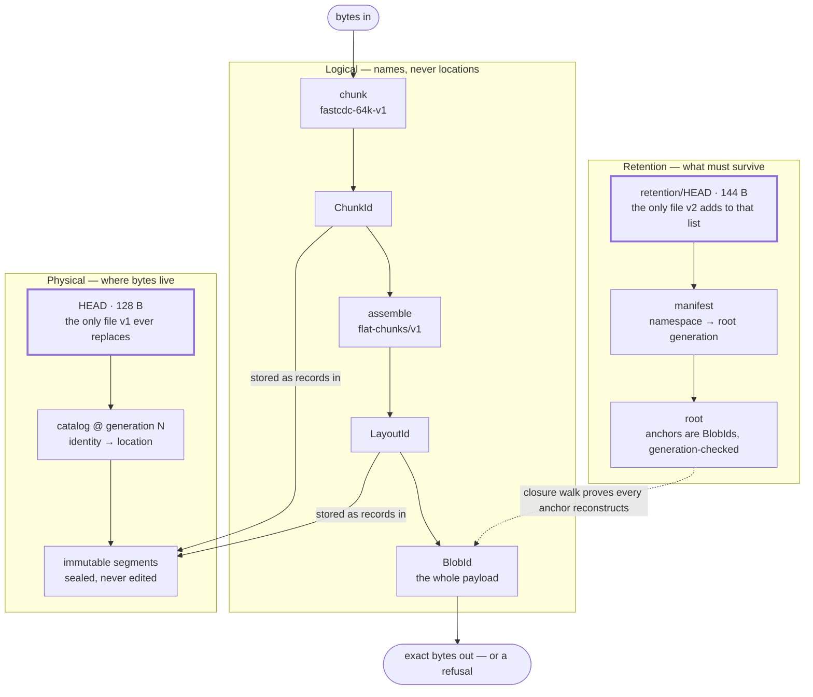

# Keep

**Correctness-first content-addressed storage.**

> For a given content identity, Keep must return exactly the bytes named by
> that identity — or refuse.

Everything else in this repository exists to make that sentence true under
power loss, process death, corrupted disks, and byte-identical files swapped
in underneath it. The
[authenticated reconstruction contract](docs/invariants/authenticated-reconstruction/README.md)
states the promise precisely, including its limits.

Keep is a standalone Rust library. It is the storage layer beneath
[Graft](https://github.com/flyingrobots/graft) and
[Echo](https://github.com/flyingrobots/echo), and it is built so that neither
of them — nor anything else — can weaken its guarantee by leaning on it.

## Why it exists

Most storage answers *"did you save my bytes?"* with a return code and a
shrug. The write returned zero; the file is probably on disk; if the machine
lost power between the write and the flush, you find out later.

Keep refuses to shrug. If it cannot prove it holds the exact bytes a name
refers to, it fails loudly instead of returning a plausible approximation.
That posture is called **fail-closed**, and it is much harder than it sounds:

- a disk that returns a corrupted block does not announce itself;
- a process killed mid-update leaves state that *looks* finished;
- a byte-for-byte identical file substituted at the same path reads as the
  original.

Keep is required to refuse all three, before mutating anything.

## What it guarantees today

- **Exact identity.** `BlobId`, `ChunkId`, `LayoutId`, and
  `StorageProfileId` are strict, versioned, and canonically encoded, with
  language-neutral golden and mutation corpora.
- **Deterministic chunking.** The frozen `fastcdc-64k-v1` profile splits
  input by content, so an insertion near the front of a file leaves the
  chunks after it untouched and deduplicated.
- **Authenticated reads.** Whole-blob reconstruction verifies every chunk,
  replays the storage profile, and verifies the complete `BlobId` before a
  single byte reaches the caller. It also provides
  authenticated exact byte-range reads that load only the overlapping chunks
  and state their narrower claim explicitly.
- **Durable version-1 segment store.** `StagedSegment` writes only
  content-admitted records; `AdmittedSegment` exposes payloads only after
  complete framing, checksum, and identity verification. Immutable segments,
  generation-versioned catalogs, and a fixed-width `HEAD` are published
  through an ordered protocol whose every step is a named crash point.
  Platform admission is Linux ext4, non-casefolded, one writer.
- **Proven restart recovery for version 1.** The crash matrix kills real
  writer processes at 105 before/during/after coordinates
  (`KEEP-CRASH-001`–`035`) and verifies the store lands in exactly one
  documented lawful state each time.
- **Version-2 retention and migration, forward path.** Explicit retention
  roots, deterministic closure verification, a one-way 21-phase migration,
  and a 17-phase retention publication — all with production filesystem
  writers, all preserving every version-1 byte.

## What it does not do yet

Version 2 writes correctly from a clean start. It cannot yet pick up the
pieces if it dies partway through. Until it can, **version 1 is the only
store admitted for production.**

| Gap | Tracked |
| --- | --- |
| Restart recovery for retention publication and migration | [#19](https://github.com/flyingrobots/keep/issues/19) |
| Reader fence binding one consistent catalog + retention snapshot | [#19](https://github.com/flyingrobots/keep/issues/19) |
| Precise verification reports at explicit depths | [#20](https://github.com/flyingrobots/keep/issues/20) |
| Garbage collection and identity-preserving compaction | [#21](https://github.com/flyingrobots/keep/issues/21) |
| Bounded production ingestion through the durable store | [#82](https://github.com/flyingrobots/keep/issues/82) |
| Encrypted representations | [#86](https://github.com/flyingrobots/keep/issues/86) |

Keep also does not claim secure deletion. Releasing a retention root
publishes a successor generation; it does not assert that bytes were
destroyed.

The authoritative status of every requirement, with the test that proves it,
is the ledger in
[`docs/formats/segment-store-v2/requirements.md`](docs/formats/segment-store-v2/requirements.md).
Its first rule: *a planned case is not evidence.*

## How it works

Three layers. Names point down into storage; proofs point back up. Every
physical thing is named by a hash of what it contains, and every retention
claim is verified by walking down to the bytes. Only two files are ever
replaced in place:



The core protocol logic knows nothing about filesystems. It is written
against capability traits — `RetentionPublicationStorage`, for example, names
seventeen durability capabilities and nothing more. Filesystem behaviour lives
in adapters that implement those traits. The ordering laws are proved
exhaustively against fault-injecting fakes, and separately against real disks.

Every durable change runs as a numbered phase sequence. Files are staged,
synchronised, hard-linked into place without replacement, and only then is a
fixed-width head replaced atomically. Cleanup happens after the commit, never
before. Staged files are verified by device and inode identity at every
transition, so a substituted byte-identical file refuses.

The core holds no clock, no caller identity, no paths, and no application
policy. Retention proves a *physical reconstruction* claim only — never what
the content means, who owns it, or whether deleting it is legally safe.

## Try it

Keep is `0.0.0` and unpublished; build from source. The in-memory
[non-durable reference CAS](docs/architecture/reference-store/README.md) is
executable evidence for the storage laws, not a durable backend — process
death loses everything in it.

```rust
use std::io::Cursor;
use keep::{LayoutEntryLimit, ReferenceStore, ReferenceStoreCapacity};

let mut store = ReferenceStore::new(ReferenceStoreCapacity::new(1_048_576));

// Stage: chunk, hash, and hold the bytes without making them visible.
let mut source = Cursor::new(b"exact bytes, or nothing");
let staged = store.stage(&mut source, LayoutEntryLimit::MAXIMUM)?;

// Commit: the explicit staged-to-visible transition.
let published = staged.commit(&mut store)?;

// Read back: every chunk verified, the complete BlobId verified, then bytes.
let mut output = Vec::new();
store.reconstruct(published.target(), &mut output)?;
assert_eq!(output, b"exact bytes, or nothing");
# Ok::<(), Box<dyn std::error::Error>>(())
```

Run the full gate suite the way CI does:

```bash
cargo test --workspace --all-features --locked
cargo xtask durability-crash-matrix        # kills real writer processes
cargo xtask golden-file-worldline-check
cargo xtask conformance-check
```

## Design boundary

Keep owns physical content storage: exact byte identity; chunking and
physical representation; streaming and range reads; retention roots and
storage generations; verification, recovery, compaction, and garbage
collection; optional storage encryption.

Keep does not own application semantics. The core stays independent of Echo,
Git, Graft, WARP, command-line interfaces, and application policy. An
application may give stored bytes causal meaning, authority, or provenance;
Keep reports only what its physical evidence supports.

## Engineering standard

Development follows the normative
[Keep Rust Engineering Standard](docs/Rust%20Standards.md): correctness,
recoverability, auditability, and maintainability outrank performance and
convenience. Stable Rust 1.96, edition 2024, `#![forbid(unsafe_code)]`,
one writer and many readers, synchronous core APIs, versioned canonical
formats. Every pedantic lint is an error. Modules are capped at 500 lines
and functions at 60.

Documentation follows the
[Keep Documentation Standard](docs/Documentation%20Standards.md). Each page
has one job; this one is the front door.

## Where to go next

| You want to… | Read |
| --- | --- |
| Understand what is proved and what is not | [`docs/invariants/`](docs/invariants/) |
| Read the byte-level formats | [`docs/formats/`](docs/formats/) |
| See the architecture and port boundaries | [`docs/architecture/`](docs/architecture/) |
| Follow the crash and recovery rules | [`segment-store-v1/recovery.md`](docs/formats/segment-store-v1/recovery.md) · [`segment-store-v2/recovery.md`](docs/formats/segment-store-v2/recovery.md) |
| Check reproducible performance evidence | [`docs/benchmarks/`](docs/benchmarks/) |
| Run the language-neutral corpora | [`conformance/`](conformance/) |
| See what changed | [`CHANGELOG.md`](CHANGELOG.md) |

## Contributing, security, license

See [CONTRIBUTING.md](CONTRIBUTING.md). Every change must preserve the core
law and pass the repository's formatting, linting, testing, and documentation
gates.

Report vulnerabilities through [SECURITY.md](SECURITY.md). Do not include
plaintext content, keys, or sensitive paths in a public issue.

Licensed under the [Apache License 2.0](LICENSE).
