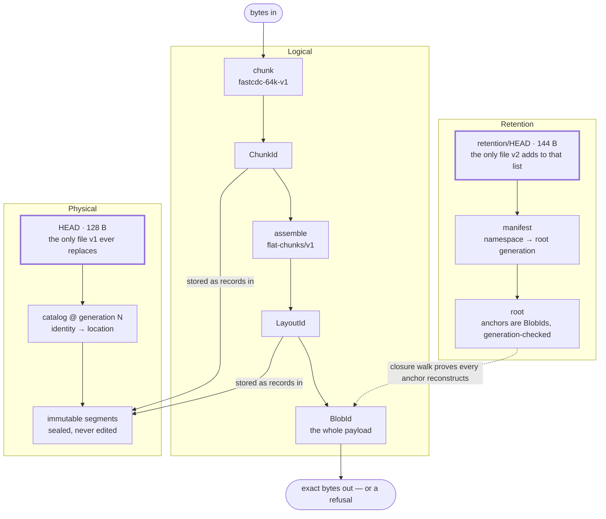

# Keep

**Correctness-first content-addressed storage.**

> For a given content identity, Keep must return exactly the bytes named by
> that identity — or refuse.

Everything else in this repository exists to make that sentence true under
power loss, process death, corrupted disks, and byte-identical files swapped
in underneath it. The [authenticated reconstruction contract][reconstruction]
states the promise precisely, including its limits.

Keep is a standalone Rust library. It is the storage layer beneath
[Graft](https://github.com/flyingrobots/graft) and
[Echo](https://github.com/flyingrobots/echo), and it is built so that neither
of them — nor anything else — can weaken its guarantee by leaning on it.

## Why it exists

Most storage answers *"did you save my bytes?"* with a return code and a
shrug. The write returned zero; the file is probably on disk; if the machine
lost power between the write and the flush, you find out later.

Keep refuses to shrug. If it cannot prove it holds the exact bytes a name
refers to, it fails loudly instead of returning a plausible approximation.
That posture is called **fail-closed**, and it is much harder than it sounds:

- a disk that returns a corrupted block does not announce itself;
- a process killed mid-update leaves state that *looks* finished;
- a byte-for-byte identical file substituted at the same path reads as the
  original.

Keep is required to refuse all three, before mutating anything.

## What it guarantees today

- **Exact identity.** `BlobId`, `ChunkId`, `LayoutId`, and
  `StorageProfileId` are strict, versioned, and canonically encoded, with
  language-neutral golden and mutation corpora.
- **Deterministic chunking.** The frozen `fastcdc-64k-v1` profile splits
  input by content, so an insertion near the front of a file leaves the
  chunks after it untouched and deduplicated.
- **Authenticated reads.** Whole-blob reconstruction verifies every chunk,
  replays the storage profile, and verifies the complete `BlobId` before a
  single byte reaches the caller. It also provides
  authenticated exact byte-range reads that load only the overlapping chunks
  and state their narrower claim explicitly.
- **Durable version-1 segment store.** `StagedSegment` writes only
  content-admitted records; `AdmittedSegment` exposes payloads only after
  complete framing, checksum, and identity verification. Immutable segments,
  generation-versioned catalogs, and a fixed-width `HEAD` are published
  through an ordered protocol whose every step is a named crash point.
  Platform admission is Linux ext4, non-casefolded, one writer.
- **Process-death recovery evidence.** The crash matrix kills real writer processes
  at 156 before/during/after coordinates (`KEEP-CRASH-001`–`052`) and
  verifies the store lands in exactly one documented lawful state each time,
  for version-1 publication and for version-2 retention publication.
- **Version-2 retention and migration, forward path.** Explicit retention
  roots, deterministic closure verification, a one-way 21-phase migration,
  and a 17-phase retention publication — all with production filesystem
  writers, all preserving every version-1 byte. Reopening a migrated store
  jointly admits its marker, intent, and receipt, binds the root's device and
  inode identity to the intent, and pins the directories it admitted. Mount
  identity remains a check within the live migration process. Publication
  binds this store's own catalog head and the catalog it selects, and refuses
  retained stages, superseded candidates, substituted
  files, replaced protocol directories, and every namespace or capacity
  violation before it writes anything. Each refusal is a typed value, not a
  string.
- **Migration restart recovery.** Recovery verifies current authority,
  classifies the observed prefix, and resumes an exact persisted migration
  intent through the remaining phases. An incomplete pre-effect intent stage
  is discarded and rebuilt from freshly verified current intent. Its crash
  matrix kills real writer processes
  at 68 before/during/after coordinates (`KEEP-CRASH-053`–`073`), preserving
  every version-1 byte. The [restart matrix](docs/testing-evidence/migration-restart-matrix.md) records additional hostile-prefix evidence and its limits.

Version-2 complete-stage retention recovery, fenced retention snapshots and model-based transitions are implemented on main through [PR #99](https://github.com/flyingrobots/keep/pull/99).

The retention process-death sequence checks the recovered head generation and exact selected-root bytes before retry; its [evidence receipt](docs/testing-evidence/retention-crash-reader-oracle.md) bounds that claim to the declared initial-publication crash coordinates.

Recovery failures retain their typed cause and report known effects separately from uncertain effects or durability under the [approved recovery contract](docs/formats/segment-store-v2/retention-recovery.md).

Writer authority coordinates cooperating writers in a managed namespace; it does not isolate arbitrary concurrent out-of-band filesystem mutation.

`DurableStore` supplies fenced authenticated whole-blob reconstruction and exact-range reads, delivered through [PR #164](https://github.com/flyingrobots/keep/pull/164); its [read contract](docs/invariants/authenticated-reconstruction/README.md) distinguishes complete-blob and range evidence and separate allocation limits.

[Explicit verification reports](docs/invariants/verification/README.md) name the subject, requested depth and evidence actually established, delivered through [PR #165](https://github.com/flyingrobots/keep/pull/165). Unsupported depths refuse; a report grants no live retention authority.

[Reader-fence process-death evidence](docs/testing-evidence/reader-fence-process.md) verifies the lock lifecycle and preserved fence bytes; it is not physical power-loss evidence.

## What it does not do yet

Incomplete retention stages are preserved and block publication pending explicit disposition; automatic disposal remains deferred in [#155](https://github.com/flyingrobots/keep/issues/155).

Complete orphans remain recovery-protected until explicit disposition lands with garbage collection (#21).

Migration restart recovery is implemented and does not grant retention authority.

A version-1 store stays admitted until its owner migrates it.

| Gap | Tracked |
| --- | --- |
| Candidate-catalog preservation of every retained closure | [#125](https://github.com/flyingrobots/keep/issues/125) |
| Garbage collection and identity-preserving compaction | [#21](https://github.com/flyingrobots/keep/issues/21) |
| Bounded production ingestion through the durable store | [#82](https://github.com/flyingrobots/keep/issues/82) |
| Encrypted representations | [#86](https://github.com/flyingrobots/keep/issues/86) |

Keep also does not claim secure deletion. Releasing a retention root
publishes a successor generation; it does not assert that bytes were
destroyed.

The authoritative status of every requirement, with the test that proves it,
is the [requirements ledger][ledger]. Its first rule: *a planned case is not
evidence.*

## How it works

Three layers. Names point down into storage; proofs point back up. Every
physical thing is named by a hash of what it contains, and every retention
claim is verified by walking down to the bytes. Only two files are ever
replaced in place:


```mermaid
flowchart TB
    IN([bytes in]) --> CHUNK

    subgraph LOGICAL["Logical"]
        CHUNK["chunk<br/>fastcdc-64k-v1"] --> CID["ChunkId"]
        CID --> ASM["assemble<br/>flat-chunks/v1"] --> LID["LayoutId"]
        LID --> BID["BlobId<br/>the whole payload"]
    end

    subgraph PHYSICAL["Physical"]
        HEAD["HEAD · 128 B<br/>the only file v1 ever replaces"]
        CAT["catalog @ generation N<br/>identity → location"]
        SEG["immutable segments<br/>sealed, never edited"]
        HEAD --> CAT --> SEG
    end

    subgraph RETENTION["Retention"]
        RHEAD["retention/HEAD · 144 B<br/>the only file v2 adds to that list"]
        MAN["manifest<br/>namespace → root generation"]
        ROOT["root<br/>anchors are BlobIds, generation-checked"]
        RHEAD --> MAN --> ROOT
    end

    CID -- "stored as records in" --> SEG
    LID -- "stored as records in" --> SEG
    ROOT -. "closure walk proves every anchor reconstructs" .-> BID
    BID --> OUT([exact bytes out — or a refusal])

    classDef mutable stroke-width:3px
    class HEAD,RHEAD mutable
```

The core protocol logic knows nothing about filesystems. It is written
against capability traits — `RetentionPublicationStorage`, for example, names
seventeen durability capabilities and nothing more. Filesystem behaviour lives
in adapters that implement those traits. The ordering laws are proved
exhaustively against fault-injecting fakes, and separately against real disks.

Every durable change runs as a numbered phase sequence. Files are staged,
synchronised, hard-linked into place without replacement, and only then is a
fixed-width head replaced atomically. Cleanup happens after the commit, never
before. Staged files are verified by device and inode identity at every
transition, so a substituted byte-identical file refuses.

The core holds no clock, no caller identity, no paths, and no application
policy. Retention proves a *physical reconstruction* claim only — never what
the content means, who owns it, or whether deleting it is legally safe.

## Try it

Keep is `0.0.0` and unpublished; build from source. The in-memory
[non-durable reference CAS](docs/architecture/reference-store/README.md) is
executable evidence for the storage laws, not a durable backend — process
death loses everything in it.

```rust
use std::io::Cursor;
use keep::{LayoutEntryLimit, ReferenceStore, ReferenceStoreCapacity};

let mut store = ReferenceStore::new(ReferenceStoreCapacity::new(1_048_576));

// Stage: chunk, hash, and hold the bytes without making them visible.
let mut source = Cursor::new(b"exact bytes, or nothing");
let staged = store.stage(&mut source, LayoutEntryLimit::MAXIMUM)?;

// Commit: the explicit staged-to-visible transition.
let published = staged.commit(&mut store)?;

// Read back: every chunk verified, the complete BlobId verified, then bytes.
let mut output = Vec::new();
store.reconstruct(published.target(), &mut output)?;
assert_eq!(output, b"exact bytes, or nothing");
# Ok::<(), Box<dyn std::error::Error>>(())
```

On Linux with the admitted ext4 profile, read an existing migrated version-two store whose retention roots anchor the requested blob. The following example is also compiled in the `DurableStore` API documentation. Its 16 MiB limit applies to aggregate catalog-selected segment bytes; catalog bytes and decoded metadata allocate separately.

```rust
#[cfg(target_os = "linux")]
fn copy_retained_blob(
    root: &std::path::Path,
    target: keep::BlobId,
    output: &mut impl std::io::Write,
) -> Result<keep::DurableReconstructionReceipt, Box<dyn std::error::Error>> {
    use keep::{
        CatalogRestartByteLimit, CatalogRestartPolicy, DurableStore, LayoutEntryLimit,
        ReaderAttemptLimit, SegmentReadPolicy, SegmentRecordLimit,
    };
    // Limit catalog-selected segment bytes; catalog and metadata allocate separately.
    let policy = CatalogRestartPolicy::new(
        SegmentReadPolicy::new(SegmentRecordLimit::MAXIMUM, LayoutEntryLimit::MAXIMUM),
        CatalogRestartByteLimit::new(16_777_216)?,
    );
    let store = DurableStore::open(root, policy, ReaderAttemptLimit::DEFAULT)?;
    let snapshot = store.snapshot()?;
    Ok(snapshot.reconstruct(target, output)?)
}
```

Snapshot admission materializes catalog bytes under the catalog format bounds and selected segment bytes under the supplied aggregate segment budget. Decoded indexes and retention records allocate additionally under separate format and record-count limits; the segment budget is not a total memory cap. Reads stream to the caller without an additional whole-blob buffer; a failed write may leave an untrusted prefix. Retain an explicit snapshot to make several reads against one fenced view. The receipt records that view but grants no retention after the snapshot is dropped. This read API performs no publication, repair or collection; see the [durable-read evidence and remaining acceptance work](docs/testing-evidence/durable-authenticated-reads.md).

Run the full gate suite the way CI does:

```bash
cargo test --workspace --all-features --locked
cargo xtask durability-crash-matrix        # kills real writer processes
cargo xtask golden-file-worldline-check
cargo xtask conformance-check
```

Select a crash campaign with `--sequence NAME` using these exact CLI names:

| Name | Campaign |
| --- | --- |
| `segment` | Segment publication |
| `catalog` | Catalog publication |
| `head` | Publication-head replacement |
| `recovery-discard` | Explicit recovery evidence discard |
| `initialization` | Writer-locked initialization |
| `retention` | Retention root, manifest, and head publication |
| `migration` | Version-one to version-two migration |

```bash
cargo xtask durability-crash-matrix --sequence retention
```

## Design boundary

Keep owns physical content storage: exact byte identity; chunking and
physical representation; streaming and range reads; retention roots and
storage generations; verification, recovery, compaction, and garbage
collection; optional storage encryption.

Keep does not own application semantics. The core stays independent of Echo,
Git, Graft, WARP, command-line interfaces, and application policy. An
application may give stored bytes causal meaning, authority, or provenance;
Keep reports only what its physical evidence supports.

## Engineering standard

Development follows the normative
[Keep Rust Engineering Standard](docs/Rust%20Standards.md): correctness,
recoverability, auditability, and maintainability outrank performance and
convenience. Stable Rust 1.96, edition 2024, `#![forbid(unsafe_code)]`,
one writer and many readers, synchronous core APIs, versioned canonical
formats. Every pedantic lint is an error. Modules are capped at 500 lines
and functions at 60.

Documentation follows the
[Keep Documentation Standard](docs/Documentation%20Standards.md). Each page
has one job; this one is the front door.

## Where to go next

| You want to… | Read |
| --- | --- |
| Understand what is proved and what is not | [`docs/invariants/`](docs/invariants/) |
| Read the byte-level formats | [`docs/formats/`](docs/formats/) |
| See the architecture and port boundaries | [`docs/architecture/`](docs/architecture/) |
| Follow the crash and recovery rules | [`segment-store-v1/recovery.md`](docs/formats/segment-store-v1/recovery.md) · [`segment-store-v2/recovery.md`](docs/formats/segment-store-v2/recovery.md) · [`segment-store-v2/migration-recovery.md`](docs/formats/segment-store-v2/migration-recovery.md) |
| See how a retention generation is published | [`segment-store-v2/retention-publication.md`](docs/formats/segment-store-v2/retention-publication.md) |
| Check reproducible performance evidence | [`docs/benchmarks/`](docs/benchmarks/) |
| Run the language-neutral corpora | [`conformance/`](conformance/) |
| See what changed | [`CHANGELOG.md`](CHANGELOG.md) |

## Contributing, security, license

See [CONTRIBUTING.md](CONTRIBUTING.md). Every change must preserve the core
law and pass the repository's formatting, linting, testing, and documentation
gates.

Report vulnerabilities through [SECURITY.md](SECURITY.md). Do not include
plaintext content, keys, or sensitive paths in a public issue.

Licensed under the [Apache License 2.0](LICENSE).

[reconstruction]: docs/invariants/authenticated-reconstruction/README.md
[ledger]: docs/formats/segment-store-v2/requirements.md
