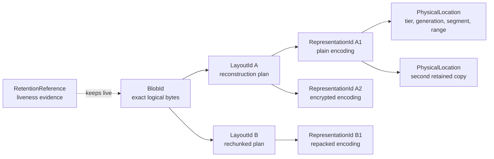

# ADR-0002: Separate Identity from Physical Storage

- Status: Accepted
- Date: 2026-07-19
- Owners: Keep identity, layout, representation, catalog, and retention layers
- Related issue: [#3](https://github.com/flyingrobots/keep/issues/3)
- Depends on: [ADR-0001](0001-exact-logical-byte-identity.md)

## Context

A content-addressed store has several tempting digest-shaped concepts. Treating
them as one identity would make normal physical changes appear to change
logical content, or would let a physical representation masquerade as the
logical bytes it is supposed to reconstruct.

Keep must support rechunking, repacking, encryption, tier migration, and
compaction without changing the identity of unchanged logical bytes. It must
also refuse stale catalog coordinates and representation substitution rather
than infer truth from a path or file's existence.

## Decision

Keep separates five concepts:



### `BlobId`: exact logical byte identity

`BlobId` is owned by the identity layer and defined by ADR-0001. It names one
exact finite logical byte sequence. It excludes all layout and physical facts.

One `BlobId` may have zero, one, or many admitted layouts. Every admitted
layout reconstructs exactly one `BlobId`.

### `LayoutId`: canonical reconstruction-plan identity

`LayoutId` is owned by the layout codec selected by a future format ADR. It
names a canonical ordered plan that reconstructs a blob, such as an ordered set
of chunk identities and logical spans. The plan body must include the target
`BlobId`; therefore a layout cannot float free of the bytes it claims to
reconstruct.

Every layout identity version uses this envelope:

```text
layout_digest(C, P) = BLAKE3-256(
    layout_magic     ||
    identity_version||
    layout_codec     ||
    P                ||
    plan_length
)
```

| Field | Size | Encoding |
| --- | ---: | --- |
| `layout_magic` | 16 | ASCII `KEEP:LAYOUT:ID` followed by two zero bytes |
| `identity_version` | 2 | unsigned big-endian identity-envelope version |
| `layout_codec` | 2 | unsigned big-endian canonical plan-codec identifier `C` |
| `P` | variable | exact canonical plan bytes, including target `BlobId` |
| `plan_length` | 8 | byte length of `P` as unsigned big-endian |

No layout codec is assigned by this ADR. A codec becomes admissible only when a
later ADR specifies its canonical plan grammar, bounds, reconstruction law, and
golden fixtures. Unknown versions and codec identifiers are refused.

One `BlobId` may have many `LayoutId` values after rechunking. One `LayoutId`
belongs to exactly one `BlobId` because the blob identity participates in its
canonical body.

### `RepresentationId`: exact stored-encoding identity

`RepresentationId` is owned by a representation codec. It names one exact
stored encoding of a layout or whole blob. Compression parameters, encryption
scheme and nonce material, framing, checksums, and the governing `LayoutId`
belong in the codec's canonical representation body when applicable.

Every representation identity version uses this envelope:

```text
representation_digest(C, R) = BLAKE3-256(
    representation_magic ||
    identity_version     ||
    representation_codec||
    R                    ||
    representation_length
)
```

<!-- markdownlint-disable MD013 -->

| Field | Size | Encoding |
| --- | ---: | --- |
| `representation_magic` | 16 | ASCII `KEEP:REPR:ID` followed by four zero bytes |
| `identity_version` | 2 | unsigned big-endian identity-envelope version |
| `representation_codec` | 2 | unsigned big-endian canonical codec identifier `C` |
| `R` | variable | exact canonical representation bytes, binding the governed layout or blob |
| `representation_length` | 8 | byte length of `R` as unsigned big-endian |

<!-- markdownlint-enable MD013 -->

No representation codec is assigned by this ADR. A later format ADR must
define decoding, bounds, authentication, checksums, canonical parameters, and
golden fixtures before assigning one.

One layout may have many representations. A representation belongs to exactly
one governing layout or explicitly declared whole-blob representation. Equal
physical subrepresentations, such as an unchanged chunk, may be shared by many
higher-level layouts without collapsing those layouts' identities.

### Physical location: mutable catalog evidence

A physical location is not stable identity. It is a catalog record that may
contain a tier, catalog generation, segment coordinate, offset, encoded length,
and local verification material. Paths, file names, segment identifiers,
offsets, inode numbers, object-store keys, and device identifiers never
participate in `BlobId`, `LayoutId`, or `RepresentationId`.

One representation may have zero, one, or many physical locations. A location
may change during copying, tier migration, or compaction without moving any
identity.

Callers receive typed logical handles. Stable public APIs must not expose a
physical location as a durable content handle.

### Retention reference: liveness evidence

A retention reference records that policy or an owner requires an identity to
remain reachable. It is evidence about liveness, not content identity,
durability, or successful recovery. Multiple references may retain one blob;
one root may retain a graph of blobs, layouts, representations, and supporting
metadata.

Removing a reference may make material eligible for collection. It never
changes the retained content's identities.

## Transition laws

<!-- markdownlint-disable MD013 -->

| Operation | `BlobId` | `LayoutId` | `RepresentationId` | Location |
| --- | --- | --- | --- | --- |
| Rechunk unchanged bytes | stable | may change | may change | may change |
| Repack same layout | stable | stable | may change | may change |
| Re-encrypt or rotate keys | stable | stable | changes unless encoded bytes are identical | may change |
| Copy to another tier | stable | stable | stable | adds or changes |
| Compact without re-encoding | stable | stable | stable | changes |
| Compact with re-encoding | stable | stable if plan is unchanged | may change | changes |
| Rebuild catalog from verified records | stable | stable | stable | may be rediscovered |
| Change one logical byte | changes | changes | changes | unconstrained |

<!-- markdownlint-enable MD013 -->

Migration may introduce a new layout or representation beside the old one.
Publication is complete only after the new object graph is verified and the
catalog atomically admits its location. Old material remains authoritative
until that transition's future durability protocol says otherwise.

## Required refusal behavior

Future implementations must express these failures as typed boundary errors:

- `StaleCatalogGeneration`: a location was resolved under a catalog generation
  that is no longer current;
- `MissingRepresentation`: no admitted location currently supplies the named
  representation;
- `RepresentationMismatch`: bytes at a location do not match the expected
  `RepresentationId`;
- `LayoutMismatch`: a decoded representation does not bind the expected
  `LayoutId`;
- `ReconstructionMismatch`: a completed reconstruction does not match the
  expected `BlobId`;
- `ConflictingCatalogEntry`: one catalog coordinate claims incompatible
  identities or ranges;
- `UnsupportedCodec`: the identity is well-framed but its codec is not
  implemented or admitted.

The exact Rust error types will be defined with the boundaries that implement
them. The semantic distinctions above are mandatory. File existence, a
successful read, or a matching file name cannot downgrade any failure.

## Worked example

Suppose the logical bytes are:

```text
alpha\nbravo\ncharlie\ndelta\n
```

They have one `BlobId`, `B`.

1. Layout `L1` describes four content-defined chunks and binds `B`.
2. Plain representation `R1` encodes `L1` into immutable segment records.
3. Encrypted representation `R2` encodes the same `L1` under a workspace key.
4. `R1` exists at two locations: hot segment generation 7 and cold object key
   91. Both locations name the same representation.
5. A later chunker produces layout `L2` with three chunks. Its restored bytes
   still verify as `B`, but `L2` and its representations have new identities.
6. Compaction copies `R2` from segment 12 offset 4096 to segment 18 offset 0.
   Only the catalog location changes.

If the catalog still points to segment 12 after generation 18 is published,
Keep reports a stale-generation or missing-representation error. It does not
read whatever happens to occupy that offset and call it `B`.

## Alternatives considered

### Use `BlobId` for chunks, layouts, and encoded representations

Rejected. Equal digest shapes do not imply equal semantic domains. Rechunking
would either move logical identity or force a layout to pretend it is raw
content. Encryption would make ciphertext indistinguishable from plaintext at
the type boundary.

### Use a physical object ID as the public handle

Rejected. Repacking, re-encryption, migration, and compaction may change the
physical object while preserving logical content. A physical ID also leaks
backend choice into consumers and turns catalog maintenance into an API break.

### Put paths and offsets in a durable content identity

Rejected. Locations become stale after ordinary crash recovery, compaction,
tier movement, or filesystem replacement. Their inclusion would make identity
machine-relative and would allow stale coordinates to masquerade as content
evidence.

### Treat retention references as ownership of content identity

Rejected. Identity remains true when no local copy is retained; retention can
expire while the named bytes and their identity remain mathematically
unchanged. Conflating them would make garbage collection rewrite history.

## Consequences

- Logical content remains stable across every physical optimization.
- Layout and representation formats can evolve without silently changing what
  a `BlobId` means.
- Catalog lookups must carry generation/evidence posture and may fail even when
  a stale path still exists.
- Reads require verification at every crossed identity boundary.
- The model introduces more typed coordinates, but each has one owner and one
  answer to “what exact thing does this name?”
- Layout and representation codecs remain deliberately unassigned until their
  own format ADRs and executable fixtures exist.
